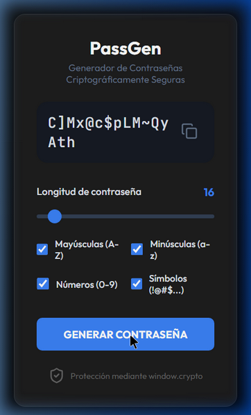

# PassGen - Generador de Contraseñas Seguras

PassGen es una aplicación de escritorio diseñada para generar contraseñas robustas y seguras de manera sencilla. Utiliza una interfaz gráfica intuitiva construida con Python para facilitar su uso a cualquier persona.

## Características

- **Longitud Personalizable:** Genera contraseñas desde 8 hasta 128 caracteres.
- **Tipos de Caracteres Seleccionables:**
  - Letras Mayúsculas (A-Z)
  - Letras Minúsculas (a-z)
  - Dígitos (0-9)
  - Caracteres Especiales (!@#$%...)
- **Interfaz Intuitiva:** Barra deslizante para longitud y botones rápidos para selección.
- **Copia Rápida:** Botón dedicado para copiar la contraseña generada al portapapeles.
- **Diseño Moderno:** Ventana centrada y organizada para una mejor experiencia de usuario.

## Versión Web (GitHub Pages)

- **URL del sitio:** [https://villaalextor.github.io/PassGen/](https://villaalextor.github.io/PassGen/)
- **Seguridad Web:** Utiliza `window.crypto.getRandomValues()` para asegurar la misma robustez que la versión de escritorio.
- **Tecnologías:** HTML5, CSS3, JavaScript Vanilla.

## Stack — Tecnologías

- **Frontend Web:** HTML5 Semántico, CSS3 Vanilla, JavaScript ES6+ Mobile-First.
- **Desktop (GUI):** Python 3 con librerías estándar `tkinter` y `tkinter.ttk`.
- **Workflow & Deploy:** VS Code, Git/GitHub, GitHub Pages.

## Seguridad

- **API Web Crypto:** Uso exclusivo de `window.crypto.getRandomValues()` en el navegador, asegurando la máxima entropía y un CSPRNG (Generador de Números Pseudoaleatorios Criptográficamente Seguro) robusto frente a predicción algorítmica.
- **Criptografía Fuerte (Desktop):** Implementación del módulo nativo `secrets` de Python, diseñado para gestionar datos críticos como contraseñas, descartando el método obsoleto y vulnerable `random`.
- **Ejecución 100% Local (Zero-Knowledge):** Toda la generación y ciclo de vida de la contraseña transcurre únicamente de forma local en el cliente/usuario final. No hay peticiones a servidores (Zero-Backend), sin almacenamiento en bases de datos o cookies, haciéndolo inmune a intercepción (Man-in-the-Middle).

## Instalación y Uso

### Versión de Escritorio
1. Asegúrate de tener Python instalado.
2. Ejecuta: `python passgen.py`

### Versión Web (Local)
1. Abre el archivo `index.html` en cualquier navegador moderno.

## Recomendaciones para una Contraseña Segura

- Utiliza al menos **12 caracteres**.
- Combina **todos los tipos de caracteres** (mayúsculas, minúsculas, números y símbolos).
- No compartas tus contraseñas y cámbialas periódicamente.